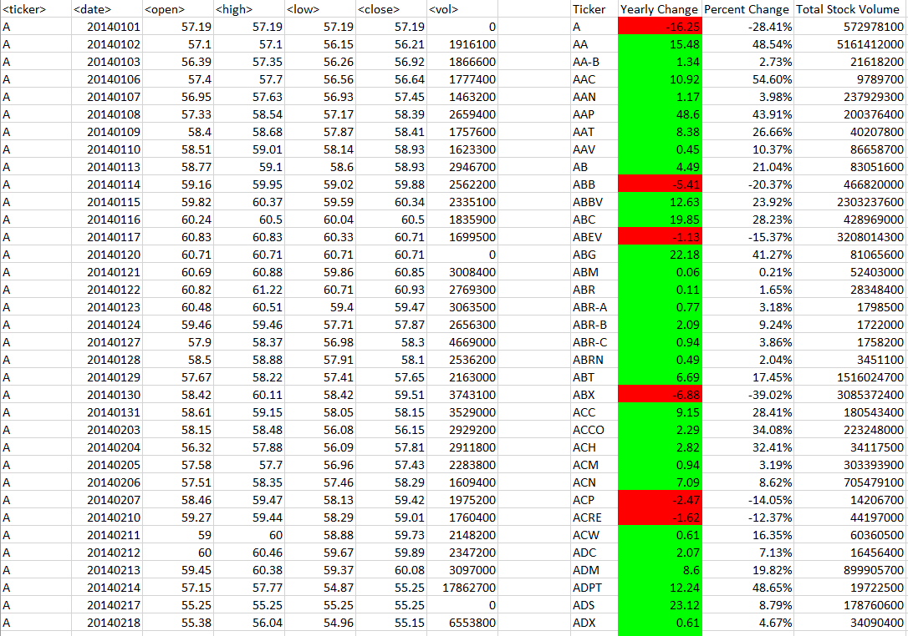
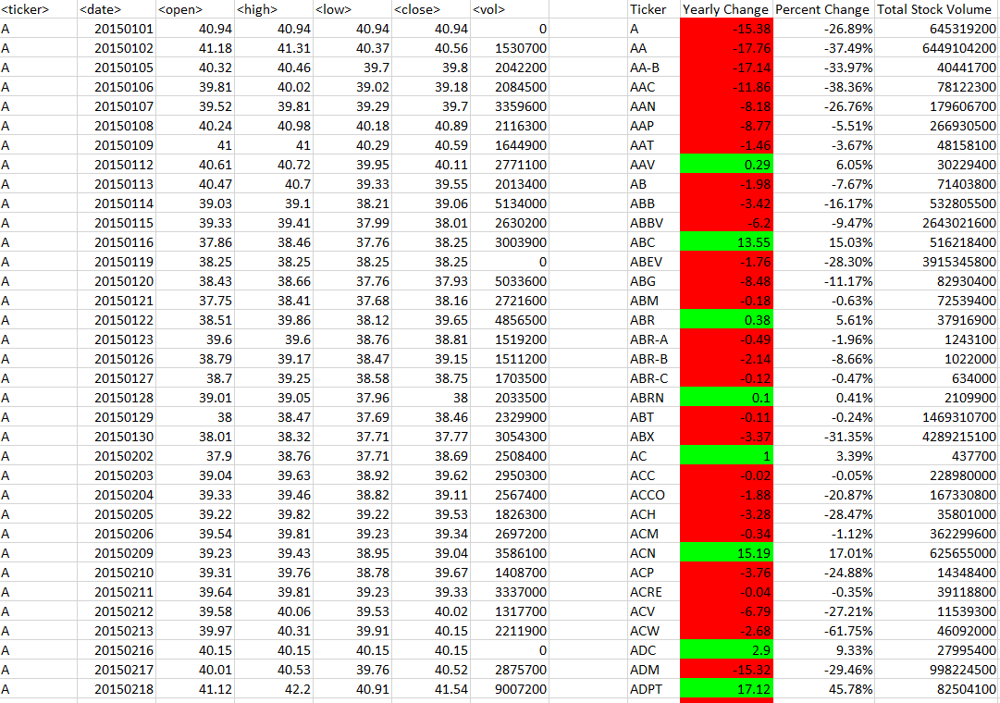
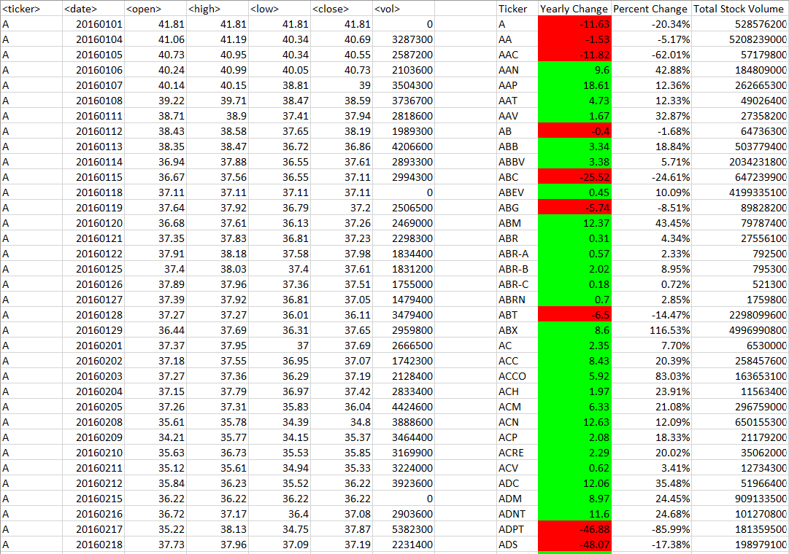

# Excel VBA Stock Analysis

* For this project I created a script that looped through stocks for 2014, 2015, and 2016 and output the following information:

  * The ticker symbol.

  * Yearly change from opening price at the beginning of a given year to the closing price at the end of that year.

  * The percent change from opening price at the beginning of a given year to the closing price at the end of that year.

  * The total stock volume of the stock.

* I applied conditional formatting to highlight positive change in green and negative change in red.

